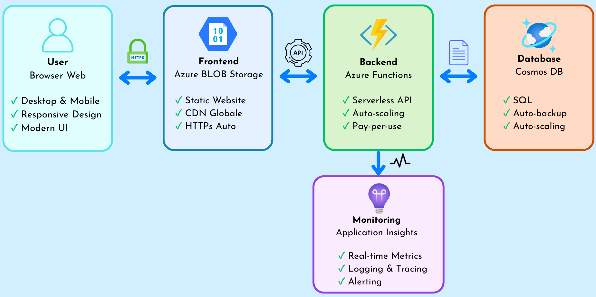

# Sistema di Prenotazione Aule - Azure Serverless Demo



## 🎯 Obiettivo della Demo

Mostrare come creare una Web-App per prenotazioni delle aule usando:
- **Azure Functions** (serverless compute)
- **Azure Cosmos DB** (database SQL managed)
- **Azure Application Insights** (monitoring)
- **Azure Storage Static Website** (hosting frontend)


## 📋 Prerequisiti

- [Account Azure (con credito disponibile)](https://portal.azure.com/)
- [CLI Azure](https://learn.microsoft.com/it-it/cli/azure/install-azure-cli?view=azure-cli-latest)
- [Node.js](https://nodejs.org/en/download)

## 🚀 Setup


### 1. Verifica Credito Azure

```bash
# Login ad Azure
az login

# Verifica sottoscrizioni disponibili
az account list --output table

# Imposta la sottoscrizione da usare (se ne hai più di una)
az account set --subscription "NOME_O_ID_SOTTOSCRIZIONE"

```

### 3. Crea le Risorse Azure (5 minuti)

```bash
# Esegui lo script di setup
cd setup
chmod +x create-resources.sh
./create-resources.sh
```

Lo script creerà:
- Resource Group
- Cosmos DB account + database
- Function App con Application Insights
- Azure BLOB Storage con deploy dei file per il frontend

### 4. Deploy delle Functions

```bash
# Torna alla root del progetto
cd ..

# Vai nella cartella del backend e poi nella cartella dove ci sono le functions
cd backend/functions

# Installa dipendenze
npm install

# Deploy su Azure
func azure functionapp publish <NOME_FUNCTION_APP>
```

## 📁 Struttura del Progetto

```markdown
azure-serverless-demo/
├── DevContainer/
├── setup/                          # Script di setup Azure
│   ├── create-resources.sh
│   └── cleanup.sh
├── backend/
│   ├── functions/                  # Azure Functions
│   │   ├── createBooking/
│   │   ├── getBookings/
│   │   ├── deleteBooking/
│   │   └── getAvailableRooms/
│   └── testing/                    # Script di test
│       └── postman-collection.json # Collection per test con Postman
└── frontend/
    ├── index.html                  # Homepage dell'app
    ├── script.js                   # Logica JavaScript
    └── style.css                   # Foglio di stile dell'app
```

## 🧹 Cleanup delle risorse

```bash
cd setup
./cleanup.sh
```

Questo eliminerà tutte le risorse per evitare costi.

## 📚 Risorse Aggiuntive

- [Documentazione di Azure](https://docs.microsoft.com/azure)
- [Azure for Students](https://azure.microsoft.com/free/students/)
- [Lista dei servizi free](https://azure.microsoft.com/it-it/pricing/free-services/)

